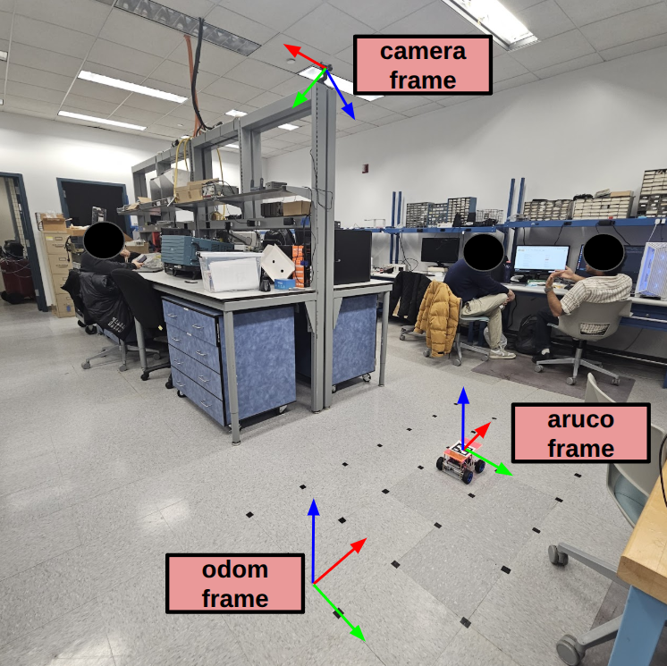
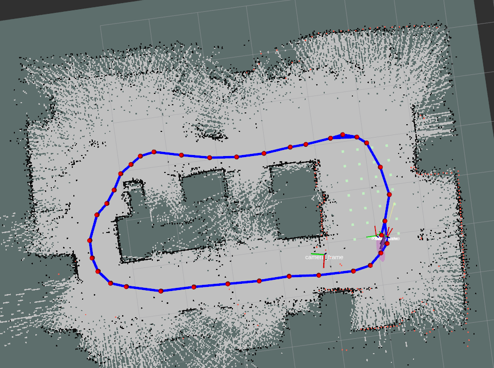
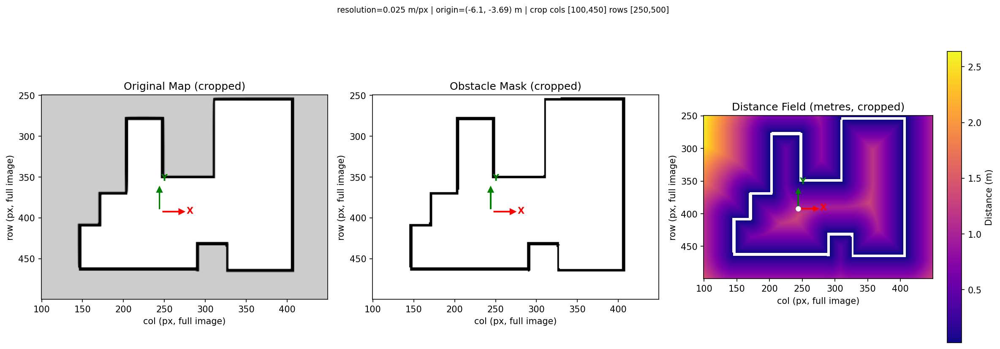

# navbot_ros

This package contains ROS drivers and solutions for EKF and Particle Filtered, built on the two-wheel drive from the ROB-GY 6213 course. More information is on the class website in 

<p align="center">
    
    <a href="https://sites.google.com/nyu.edu/rob-gy6213">https://sites.google.com/nyu.edu/rob-gy6213</a>
</p>

## Installation (Manual)
This is a standard ROS2 package. For convenience, docker workflow is provided.

```
mkdir -p ~/ros2_ws/src
cd ~/ros2_ws/src
git clone https://github.com/Abanesjo/navbot_ros navbot
cd ~/ros2_ws
rosdep install --from-path src --ignore-src -r -y
colcon build --symlink-install && source install/setup.bash
```

Also make sure the necessary python packages are installed
```
pip install -r requirements.txt
```

Then modify the following files as per the setup (IP addresses, covariances, etc.)
- `navbot_ros/parameters.py`
- `robot_arduino_code/robot_arduino_code.ino`

The `.ino` file is what is compiled on the robot's arduino board.

## Installation (Docker)
For convenience, docker workflow is also supported.

Make sure that [docker](https://www.docker.com/get-started/) is installed.

Then clone and run

```
git clone https://github.com/Abanesjo/navbot_ros navbot
./build_and_run.sh
```

This will put you automatically inside the docker container where you can run the commands below. The volume is mounted onto host and the container is automatically deleted after exit.

## Extended Kalman Filter
The EKF implementation fuses wheel odometry and camera odometry, as shown in the demonstration below. 


<p align="center">
    
    <a href="https://youtu.be/C_pzKH91Ji0">https://youtu.be/C_pzKH91Ji0</a>
</p>

You can launch the EKF via

```
source install/setup.bash
ros2 launch navbot_ros bringup_ekf.launch.xml rviz:=true
```

## Particle Filter
In this setup, odometry is estimated via a particle filter. The baseline wheel odometry is corrected using measurements from a LiDAR. 

### Map Creation
First, a map is created. For this, we combine the accurate EKF odometry with the LiDAR sensing to generate a map from [slam_toolbox](https://github.com/SteveMacenski/slam_toolbox). 

<p align="center">
    
</p>

The mapping process can be started with

```
source install/setup.bash
ros2 launch navbot_ros bringup_slam.launch.xml
```


Once the map is sufficient, it can be saved by calling

```
ros2 service call /slam_toolbox/save_map slam_toolbox/srv/SaveMap "name: {data: 'map_name}"
```

Note that for the next step, it is recommended to use third party image editing software to clean up the map to improve performance. 

### Distance Field Generation

As part of the particle filter process, the map is used to compute a distance field offline. 

<p align="center">
    
</p>

### Particle Filter Implementation
TODO
